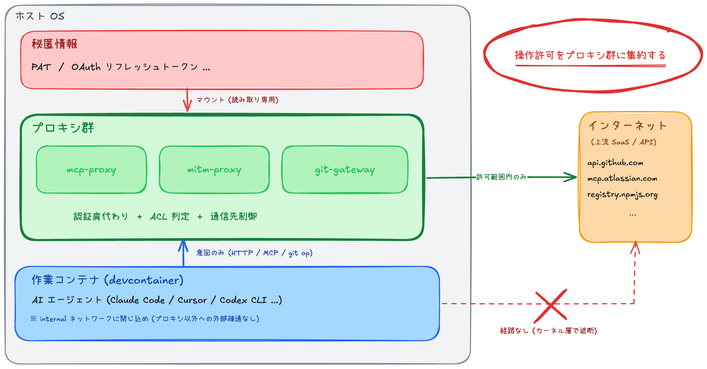

# devcontainer-sandbox-patterns

devcontainer をサンドボックスとして扱うための隔離パターン集。AI エージェント (Claude Code / Cursor / Codex 等) を運用する開発者向けに、標準的な devcontainer 構成から一歩踏み込んだ隔離要件をどう実現するかを追求した技術的探索の成果をまとめたもの。

AI エージェントが任意コード実行能力を持つ前提だと、例えば読み込んだ外部コンテンツに攻撃指示が紛れ (プロンプトインジェクション)、GitHub PAT を読み出して任意リポジトリに push する、といったシナリオが成立しうる。これに対する一般的な対策は PAT スコープの最小化やドメインレベルでの通信先制限で、被害範囲や疎通先を絞れる。本書のレシピはさらに踏み込んで、秘匿情報自体を作業コンテナの外 (プロキシ側) に置き、許可ドメイン内でも特定の操作 (例: 指定したリポジトリへの push) だけ通る粒度で絞る形を目指す。

この踏み込んだ目標を 1 つの作業コンテナ内で実装しようとすると、ファイル ACL / プロセス権限 / 通信制御など複数のレイヤを同時に整える必要があり、どれか一つが崩れたら全体が崩れる構造になる。本書では、外部操作を通すかの判定をプロキシ群に集めることで、何が崩れたら全体が崩れるかの線 (= 信頼境界) を 1 箇所に揃える。

> [!CAUTION]
> **無保証**: 本リポジトリは隔離パターンと設計の考え方を整理する技術的探索であり、実装や構成に脆弱性や不具合が存在しないことを保証するものではない。利用者の責任で評価・採用すること (詳細は [LICENSE](./LICENSE) の `AS IS` 条項)。

> [!IMPORTANT]
> **AI 支援**: 本リポジトリのコードおよびドキュメントは [Claude](https://claude.com/) (主に Claude Code) を用いて実装・執筆している。設計判断・監修・レビューは mitaki28 が行っているが、文章・コードは生成されたものである。

## 1 分で分かる概要

本書のレシピは、(1) 秘匿情報を作業コンテナの外に出し、(2) 外向きの通信先を細かい粒度で絞る、という 2 軸を、(3) 通すかの判定をプロキシ側に集めることで成立させる。既存の devcontainer 構成との対比を以下に示す。

| | 既存の devcontainer 隔離 | 本リポジトリのパターン |
|---|---|---|
| 秘匿情報の届く先 | 作業コンテナ | **プロキシコンテナのみ**<br>(作業コンテナには届かない) |
| 外部への外向き通信 | 任意ホスト可<br>(絞る場合もドメイン単位まで) | **プロキシ経由のみ**<br>(Docker ネットワーク設定で遮断) |
| 許可判定の場所 | 作業コンテナ内<br>(コンテナ内権限で書き換え可能) | **プロキシコンテナ**<br>(作業コンテナから書き換え不可) |
| AI エージェント侵害時の被害 | 秘匿情報の漏洩 + 任意送信 | プロキシ許可範囲のみ |



具体的な実装は以下 2 つの基本コンポーネント + レシピ集として提供される:

- **`mcp-proxy`** — 細粒度・明示的な操作許可を実現するため、MCP の前段に立ち、MCP ツール単位での ACL を提供する
- **`mitm-proxy`** — 粗粒度・暗黙的な操作許可を実現するため、HTTP(S) 通信の前段に立ち、ホスト単位に加え HTTP メソッド / パス単位での ACL を提供する

これらの基本コンポーネントを組み合わせて、レシピ / 統合構成 / 代替・参考実装の 3 階層を提供する。

なお、本書の手法は、視点を変えれば **作業コンテナに対する操作許可のフレームワーク** としても読むことができる。踏み込んだ隔離要件を満たす用途に限らず、作業コンテナに対する操作許可の設計や管理にも応用できる (詳細: [docs/02-design.md](./docs/02-design.md) §5)。

## 想定する読者と前提

以下に当てはまる読者向け:

**やりたいこと**:

- AI エージェント (Claude Code / Cursor / Codex CLI 等) を、許可した範囲内で運用したい
- 標準的な devcontainer 構成から踏み込んだ隔離要件 (秘匿情報を作業コンテナの外に置く / 許可ドメイン内でも操作粒度を絞る) を実現したい
- 信頼境界の置き方や操作許可のモデルを、設計の考え方として参照したい

**適用範囲**:

- 個人開発者のローカル環境での利用を主眼とする
- チーム共有環境 / CI / 本番環境への直接適用は想定外
- macOS + Docker Desktop 環境を想定

## 構成

```
.
├── docs/             # 読み物 (思想 → 設計 → 各論)
├── lib/              # 基本コンポーネント (mcp-proxy / mitm-proxy)
├── recipes/          # ユースケース別レシピ
├── integrated/       # 統合構成 (基本コンポーネント + レシピを 1 compose にまとめた完成形)
└── alternatives/     # 代替・参考実装 (主推奨とは別軸の選択肢)
```

### 読み物 (docs/)

順番に読むことを想定している。

1. [01-problem.md](./docs/01-problem.md) — 踏み込んだ隔離要件を明確に記述したい理由
2. [02-design.md](./docs/02-design.md) — 設計原則と、その前提・保証
3. [03-foundation.md](./docs/03-foundation.md) — Docker + internal ネットワークの前提
4. [04-mcp-proxy.md](./docs/04-mcp-proxy.md) — 基本コンポーネント mcp-proxy の設計
5. [05-mitm-proxy.md](./docs/05-mitm-proxy.md) — 基本コンポーネント mitm-proxy の設計
6. [06-cloud-mcp.md](./docs/06-cloud-mcp.md) — クラウド認証情報の短寿命化
7. [07-web-fetch.md](./docs/07-web-fetch.md) — web fetch を特化 MCP に集約する
8. [08-git-gateway.md](./docs/08-git-gateway.md) — Git transport の隔離
9. [09-ingress.md](./docs/09-ingress.md) — 開発サーバをホストブラウザに見せる
10. [10-single-workspace.md](./docs/10-single-workspace.md) — 作業コンテナ単独起動向けの構成
11. [11-multi-workspace.md](./docs/11-multi-workspace.md) — 作業コンテナ並列起動向けの構成

付録:

- [alt-dependencies-build-time.md](./docs/appendix/alt-dependencies-build-time.md) — 実行時疎通先の最小化
- [alt-simple-http-proxy.md](./docs/appendix/alt-simple-http-proxy.md) — 独自 CA 不要の mitm-proxy 代替
- [alt-git-mitm-proxy-addon.md](./docs/appendix/alt-git-mitm-proxy-addon.md) — git-gateway の軽量代替
- [incomplete-fetch-mcp.md](./docs/appendix/incomplete-fetch-mcp.md) — 任意ホスト fetch の構造的限界

巻末:

- [99-postscript.md](./docs/99-postscript.md) — あとがき

### コード (lib/, recipes/, integrated/, alternatives/)

すべて `docker compose run --rm --build smoke` (smoke test = 最小疎通検証) またはレシピごとのシェルスクリプトで動作確認できる。各レシピの README に手順あり。

**基本コンポーネント** (`lib/`) — レシピや統合構成から再利用される土台:

| 実装 | 役割 | 説明章 |
|---|---|---|
| `lib/mcp-proxy/` | 細粒度・明示的な操作許可 | [04](./docs/04-mcp-proxy.md) |
| `lib/mitm-proxy/` | 粗粒度・暗黙的な操作許可 | [05](./docs/05-mitm-proxy.md) |

`lib/mcp-proxy/examples/` (api-key 認証 = GitHub MCP / OAuth 2.1 = Atlassian Rovo) は **`lib/mcp-proxy` の利用例** として位置付け、統合構成から再利用される。詳細は [04-mcp-proxy.md](./docs/04-mcp-proxy.md) と examples 側 README を参照。

**レシピ** (`recipes/`) — ユースケースごとに独立して動作する隔離パターン:

| 実装 | 役割 | 説明章 |
|---|---|---|
| `recipes/cloud-mcp-with-short-lived-credential/` | クラウド認証情報の短寿命化 | [06](./docs/06-cloud-mcp.md) |
| `recipes/git-gateway/` | Git transport の隔離 | [08](./docs/08-git-gateway.md) |
| `recipes/ingress-single-workspace/` | 作業コンテナ単独起動向けのインバウンド経路 | [09](./docs/09-ingress.md) |
| `recipes/ingress-multi-workspace/` | 作業コンテナ並列起動向けのインバウンド経路 | [09](./docs/09-ingress.md) |

**統合構成** (`integrated/`) — 基本コンポーネント + 複数レシピを 1 つの compose に組み合わせた完成形:

| 実装 | 役割 | 説明章 |
|---|---|---|
| `integrated/single-workspace/` | 作業コンテナ単独起動向けの構成 | [10](./docs/10-single-workspace.md) |
| `integrated/multi-workspace/` | 作業コンテナ並列起動向けの構成 | [11](./docs/11-multi-workspace.md) |

両者はユースケースに応じて選ぶ対等な選択肢で、同じホストポート (`127.0.0.1:8080`) を使うため同時起動は不可:

- **single-workspace** — 並列稼働を想定せず、1 スタックを順次切り替えて回す運用。構成数を抑え、shared-infra を別 compose プロジェクトとして常駐させたくない場合に向く
- **multi-workspace** — 同一プロジェクトの作業コンテナを **同時に** 複数走らせて並列タスクを進めたい運用。1 つのホストポートを全作業コンテナでサブドメインに振り分け、OAuth リフレッシュの競合を回避するために shared-infra を 1 度だけ常駐起動する 2 層構造を採る

**代替・参考** (`alternatives/`) — 主推奨とは別軸の選択肢 (軽量化 / 別アプローチ / 未完成扱い):

| 実装 | 役割 | 説明章 |
|---|---|---|
| `alternatives/dependencies-build-time/` | 実行時疎通先の最小化 | 付録 [alt-dependencies-build-time](./docs/appendix/alt-dependencies-build-time.md) |
| `alternatives/simple-http-proxy/` | 独自 CA 不要の mitm-proxy 代替 | 付録 [alt-simple-http-proxy](./docs/appendix/alt-simple-http-proxy.md) |
| `alternatives/git-mitm-proxy-addon/` | git-gateway の軽量代替 | 付録 [alt-git-mitm-proxy-addon](./docs/appendix/alt-git-mitm-proxy-addon.md) |
| `alternatives/fetch-mcp/` | 任意ホスト fetch の構造的限界 | 付録 [incomplete-fetch-mcp](./docs/appendix/incomplete-fetch-mcp.md) |

## 貢献について

貢献の方針は [CONTRIBUTING](./CONTRIBUTING.md) を参照してください。

## ライセンス

[MIT License](./LICENSE) — Copyright (c) 2026 mitaki28
