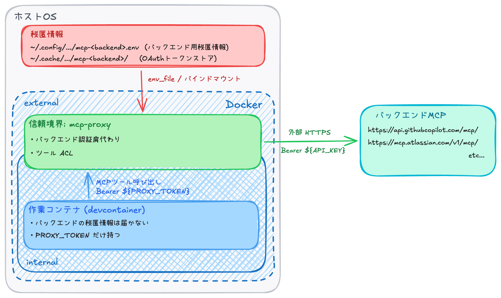

# 基本コンポーネント: mcp-proxy — 細粒度・明示的な操作許可

本章は本リポジトリの「信頼境界」を担う 2 つの基本コンポーネントのうち、**MCP プロトコル軸 (操作粒度 = MCP ツール名)** を扱う `lib/mcp-proxy` の位置付けと機能を述べる。もう一方の **HTTP 通信先軸** ([`lib/mitm-proxy`](./05-mitm-proxy.md)) との直交関係は [02-design.md](./02-design.md) §3 で先に整理してある。実装詳細・内部構造は [`lib/mcp-proxy/README.md`](../lib/mcp-proxy/) に集約する。

## 1. 章のスコープ

`lib/mcp-proxy` は、作業コンテナ側のクライアント (Claude Code 等) とバックエンド MCP サーバの間に立つプロキシである。クライアントから見ると普通の streamable-HTTP MCP として振る舞い、その裏で 1 つのバックエンド MCP にリクエストを流す。

「中間に立つ」という配置によって、認証情報 (API トークン / OAuth トークン) をプロキシ側で持ってバックエンドに注入する、操作粒度をプロキシ側で絞る、という形が成立する。実装は TypeScript + Node + `@modelcontextprotocol/sdk`。具体的に何ができるかは次節の表を参照。

なお本実装は、本リポジトリの構成アイデアを示すための **ミニマル実装例** である。MCP プロキシ / ゲートウェイ製品は既に多数存在するが、本書はそれらと方向性を分け、個人ローカル用途の隔離パターンを最小構成で示すことに焦点を絞る。`@modelcontextprotocol/sdk` の transport / OAuth client が中継基盤として充実しているため、プロキシ自体は接続コードに薄く収まる (学習目的も兼ねる)。

## 2. 機能

| できること | 概要 |
|---|---|
| MCPの中継 | stdio / streamable-HTTP どちらのバックエンドでも streamable-HTTP として再公開 |
| 接続認証 | 作業コンテナ ⇔ プロキシ間は Bearer 認証。作業コンテナ外からの意図しない利用を防止 |
| 認証肩代わり | バックエンドへの Bearer / API キー注入、または OAuth 2.1 フロー駆動 (初回はブラウザで認可) |
| 操作粒度 ACL | MCP ツール名単位での許可 / 拒否。許可外はバックエンドに届かず、ツール一覧からも消える|
| 環境変数の絞り込み | プロキシの秘匿情報をバックエンド MCP に流さない (許可した環境変数だけ通す) |

## 3. 構成イメージ

mcp-proxy を実際に組み込んだ際の典型的な配置は次の通り。3 つの主体 (ホスト OS / プロキシコンテナ / 作業コンテナ) と秘匿情報の流れを示す:

ポイント:

- **秘匿情報はホスト側のファイル (`~/.config/devsbx/mcp-*.env` や `~/.cache/devsbx/mcp-<backend>/`) に置き、プロキシだけが読み込む**。env ファイルは `env_file` 経由でプロキシコンテナの環境変数に、OAuth トークンストアディレクトリはバインドマウント経由で渡る。**作業コンテナのファイルシステムにも環境変数にも秘匿情報は入らない**
- **`PROXY_TOKEN` は作業コンテナとプロキシで共有する 1 つの値**。作業コンテナ側の `.mcp.json` が `headers.Authorization` に `Bearer ${PROXY_TOKEN}` を組み立ててプロキシに投げる。これはプロキシへの接続認証専用で、**バックエンド (GitHub / Atlassian) の権限は一切持たない**
- **バックエンド認証情報 (API トークン / OAuth のアクセス / リフレッシュトークン) は作業コンテナに届かない**。プロキシだけが読み出してバックエンドリクエストに注入する

## 4. 1 プロキシ 1 MCP の責務分離

**集約 (複数のバックエンド MCP の統合) はプロキシの責務に含めない**。1 プロキシインスタンス = 1 バックエンド MCP の中継のみを行う。

この方針を選んだ理由:

- 1 つの MCP がクラッシュしたり OAuth 期限切れになっても、他の MCP には波及しない
- ログ・トレースが「1 プロキシ = 1 MCP」で追えるので原因切り分けが楽
- HTTP 受け → バックエンドへ流すだけで本体が成立し、コードが薄く保てる

集約は別のゲートウェイ層の責務として切り出す方針で、プロキシ自体はバックエンドへの転送に責務を絞る。

## 5. 「信頼境界」としての位置付け

[02-design.md](./02-design.md) §4 で並べたレシピ評価軸との対応関係を整理する:

| 評価軸 | mcp-proxy がどう満たすか |
|---|---|
| 秘匿情報は作業コンテナ外に置く | API トークンは env ファイル (`~/.config/devsbx/mcp-*.env`) でプロキシの環境変数に、OAuth のアクセス / リフレッシュトークンは `~/.cache/devsbx/mcp-<backend>/` のバインドマウントでプロキシに渡す。作業コンテナ側のファイルシステムにも環境変数にも入らない |
| 作業コンテナはプロキシのみと通信する | 作業コンテナは internal ネットワークに閉じ、プロキシだけがバックエンド MCP に出る ([03-foundation.md](./03-foundation.md) の二層ネットワークパターン) |
| ACL はプロキシ側で評価する | ツール名単位での許可 / 拒否はプロキシ側で評価 (作業コンテナから書き換え不能) |
| 境界ドメインは信頼できる先に限定する | 1 プロキシ 1 MCP なので、バックエンドに出る通信先は CLI 引数で指定した 1 ドメインだけ |

mcp-proxy は **「MCP プロトコル軸の境界実装」** として、4 つの評価軸すべてを満たす形になっている。

なお mcp-proxy は、[02-design.md](./02-design.md) §2 で述べた「自作領域を境界制御に必要な範囲まで絞り、外部依存を標準コンポーネントに集約する」アプローチの具体形として、実装を `@modelcontextprotocol/sdk` の transport / OAuth client を組み合わせる接続コードに留め、MCP プロトコル詳細・OAuth フロー詳細を SDK 側に閉じ込めている。

## 6. 詳細は実装側ドキュメントへ

本章では設計の骨格だけを述べた。実装の内部構造 (セッションライフサイクル管理、双方向メッセージの中継、アイドルセッションの解放、OAuth コールバックの state 検証とタイムアウト防御、SDK 連携時の罠 etc.) と詳細な動作仕様は [`lib/mcp-proxy/README.md`](../lib/mcp-proxy/) に集約してある。プロキシを改修・拡張する際はそちらを参照のこと。

実際の利用例として、本リポジトリでは [`lib/mcp-proxy/examples/`](../lib/mcp-proxy/examples/) に **api-key 認証** (GitHub MCP) と **OAuth 2.1** (Atlassian Rovo MCP) の 2 パターンを置いている。§3 の構成図がそのまま動く形で組まれているので、初めて mcp-proxy を触る場合の参照に向く。

## 7. 次の章への接続

本章で扱った mcp-proxy は「MCP プロトコル軸」の境界を担う。HTTP 通信先軸を担うもう一方は次章。

- [05-mitm-proxy.md](./05-mitm-proxy.md) — 基本コンポーネント mitm-proxy の設計
