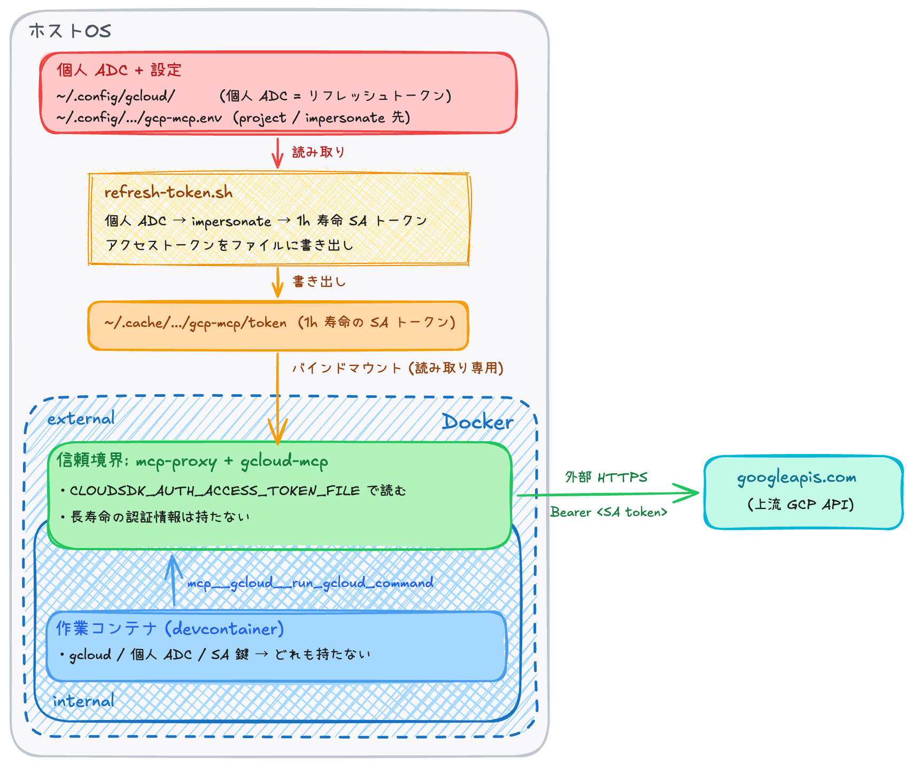

# レシピ: クラウド認証情報の短寿命化

ここから先はレシピ各論。本章はクラウドプロバイダ (GCP / AWS / Azure 等) に対する MCP 連携を扱う `recipes/cloud-mcp-with-short-lived-credential/` を取り上げる。

## 1. 章のスコープ

クラウド認証情報を AI エージェントに触らせる構成は、他のレシピと比べて **失敗の影響が桁違いに大きい**。本章ではこの「重さ」に応じて、これまでのレシピに **「プロキシ内の認証情報自体を短寿命化する」追加レイヤ** を入れた構成 (`recipes/cloud-mcp-with-short-lived-credential/`) を扱う。

具体例として **Google Cloud MCP (gcloud-mcp)** を `mcp-proxy` 経由で公開する形を取り、sandbox SA への impersonation と短寿命のアクセストークンのファイル受け渡しを組み合わせる。

## 2. クラウド認証情報固有のリスク

クラウド認証情報が他レシピより重い理由は 3 つ:

- **従量課金** — 暴走ループや誤呼び出しが直接の金銭被害になる。GitHub PAT や Atlassian トークンと違って「使われすぎたら課金される」性質がある
- **公開影響** — デプロイ系 / 公開バケット / IAM 変更などは世界に出る。誤操作の影響範囲がインターネット側に広がる
- **長寿命の認証情報の漏出範囲** — 個人アカウントの ADC (リフレッシュトークン) や SA 鍵は 1 個あたりの権限範囲が「アカウント全体」相当で、漏出すると影響範囲が極めて広い

一方で、クラウド側は強い IAM と短寿命なトークンの仕組みを既に持っている。これを正しく使えば、**devcontainer 内には長寿命の認証情報を 1 つも置かない設計** が、他カテゴリよりむしろ達成しやすい (材料が揃っている)。

## 3. このレシピが追加する 2 つの原則

本章のレシピは [02-design.md](./02-design.md) §1 の「信頼境界をプロキシ群に置く + 作業コンテナ自身は認可を制御できない」を踏襲した上で、クラウド固有の追加原則を 2 つ重ねる。

### 3.1 sandbox SA + impersonation

個人アカウントの ADC や全権 SA をプロキシ / 作業コンテナに渡さず、**目的別に作った sandbox SA に impersonate** する。devcontainer に流れる権限は、この sandbox SA の IAM スコープ内に限定される。

- 個人アカウント ADC はホスト (`~/.config/gcloud/`) に閉じ込め、プロキシにはバインドマウントしない
- impersonation 自体はホスト側 `gcloud auth print-access-token --impersonate-service-account=...` で行う
- sandbox SA は **最小権限から始める** (例: 最初は `roles/artifactregistry.reader` の 1 個だけ、必要になったら都度追加)
- `roles/owner` / `roles/editor` / `roles/viewer` / `roles/iam.*` / `roles/billing.*` のような全権・高権限ロールは付けない

### 3.2 credential-lifetime-cap

プロキシ内にも **長寿命の認証情報 (リフレッシュトークン / SA 鍵) を一切置かない**。プロキシが侵害されても、攻撃者が手に入れるのは **最大 1 時間寿命の SA アクセストークンだけ** に抑える。

- ホスト側で発行された 1h 寿命のアクセストークンを **ファイルとして** プロキシに渡す
- プロキシはトークンファイルを読み取り専用でマウントするだけ。リフレッシュも DCR も持たない
- 寿命中にリフレッシュが要る場合は、ホスト側で再発行 (新しいファイルが上書きされる)

これは [02-design.md](./02-design.md) §4 の 4 評価軸に加えて、**「プロキシ内に長寿命の認証情報を置かない」** という 5 つ目の軸を立てる形になる。本リポジトリの他レシピは「秘匿情報を作業コンテナ外に置く」までで止まるが、クラウドの場合は **作業コンテナ外 (= プロキシ) にすら長寿命の認証情報を置きたくない** ところまで踏み込む。

## 4. 構成

§3 の 2 原則を実装した構成は次の通り。

ポイント:

- **資格情報の連鎖の動作確認はホスト側で完結する** — `refresh-token.sh` が成功した時点で、impersonation 経路と SA roles が正しく設定されていることがホスト側で確定する。コンテナ起動後に「実は権限不足だった」が判明する経路が無い
- **プロキシ内にリフレッシュトークンは無い** — リフレッシュはホスト側 `refresh-token.sh` の責務で、プロキシはトークンファイルを読むだけ
- **gcloud-mcp は `CLOUDSDK_AUTH_ACCESS_TOKEN_FILE` でファイルからトークンを読む** — `mcp-proxy` の `--pass-env` 機構 ([04-mcp-proxy.md](./04-mcp-proxy.md) 機能スコープ) で必要な環境変数だけがバックエンド MCP に届く
- **トークン切れは即座に表面化する** — 寿命が尽きると API が 401 で落ちるため、気づかれずに古いトークンを使い続けることはない

## 5. なぜシンプルな ADC 直マウントを採用しないか

最もシンプルな構成は「`~/.config/gcloud/` をプロキシコンテナにバインドマウントするだけ」だが、本リポジトリでは採用していない。理由は 2 つ:

- **設定ミス 1 個で個人アカウント全権が漏れる** — `CLOUDSDK_AUTH_IMPERSONATE_SERVICE_ACCOUNT` 等の環境変数マッピングが空文字化していた場合、コンテナは ADC (リフレッシュトークン) を使って **個人アカウントとして** API を叩いてしまう。失敗が表面化せず、過剰な権限のまま「普通に成功」してしまう
- **ADC は 1 個あたりの権限範囲が広く、漏出が金銭被害に直結** — API キーと違って権限の単位が「Google アカウント全体」相当。GCP プロジェクトの全サービス / 全リソースに対する操作権限を一度に流出させうる

本レシピは「ホスト側で短寿命なトークンに変換してからコンテナに渡す」ことで、上記 2 つの問題を構造的に避けている。特に **「設定ミスで個人アカウントとして動く経路」が存在しない** のが大きい (ホスト側で `gcloud auth print-access-token --impersonate-service-account=...` が成功した時点で、資格情報の連鎖は正しく動いていることが確定する)。

## 6. 評価軸との対応

[02-design.md](./02-design.md) §4 の 4 評価軸 + クラウド固有の追加軸 (§3.2) に対して、このレシピがどう答えるか:

| 評価軸 | このレシピがどう満たすか |
|---|---|
| 秘匿情報は作業コンテナ外に置く | 個人アカウント ADC はホスト (`~/.config/gcloud/`) に閉じ、プロキシにも作業コンテナにもバインドマウントしない |
| 作業コンテナはプロキシのみと通信する | 作業コンテナは internal ネットワークに閉じ、プロキシ以外への外向き通信は Docker ネットワーク設定で遮断 |
| ACL はプロキシ側で評価する | ツール ACL は mcp-proxy 側で評価。加えて IAM (sandbox SA のスコープ) も第 2 防衛線として効く |
| 境界ドメインは信頼できる先に限定する | プロキシが出る通信先は GCP API のドメインだけ |
| **(追加) プロキシ内に長寿命の認証情報を置かない** | プロキシ内には **1 時間寿命のアクセストークンファイル** だけ。リフレッシュトークン / SA 鍵はホスト内に閉じる |

## 7. 限界

- **寿命中のプロキシ侵害** — プロキシが侵害されると、寿命残分 (最大 1 時間弱) の SA スコープが漏れる。影響範囲は sandbox SA の IAM に閉じるため、単純な ADC マウントよりは小さい
- **クラウド側の課金は IAM の許可範囲なら止まらない** — 重課金 API (BigQuery 大量クエリ等) は budget alert / quota 制御を併用する必要がある。本レシピはそこまで扱わない

## 8. 詳細はレシピ README へ

利用手順 (sandbox SA の作成、impersonation 許可、ホスト側 ADC 確立、`refresh-token.sh` の実行、devcontainer 起動)、サプライチェーン緩和 (gcloud-mcp のバージョン固定 / minimumReleaseAge 等) はレシピ側 README にあるのでリンクで:

- [`recipes/cloud-mcp-with-short-lived-credential/README.md`](../recipes/cloud-mcp-with-short-lived-credential/) — sandbox SA の作り方 / 短寿命なトークンファイルの利用手順 + 自動更新の運用例 (launchd / systemd / cron)

## 9. 次の章への接続

本章は **mcp-proxy の応用** として、プロキシ内の認証情報を短寿命化する追加レイヤを扱った。次章も mcp-proxy の応用で、別の事前列挙不能な領域 (任意ホストへの web fetch) に対する **特化 MCP に集約する** アプローチを扱う。

- [07-web-fetch.md](./07-web-fetch.md) — web fetch を特化 MCP に集約する
