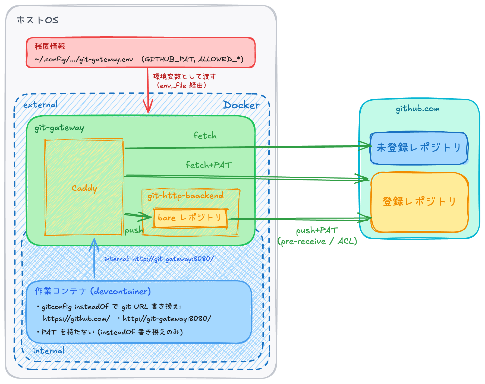

# レシピ: Git 向けのカスタムプロキシ

本章は `recipes/git-gateway/` を扱う。mcp-proxy / mitm-proxy では捌けない git transport に対して、用途特化のカスタムプロキシを自作するパターン ([02-design.md](./02-design.md) §3.3)。

## 1. 章のスコープ

devcontainer 内で `git fetch` / `git push` / `git clone` を成立させるとき、2 つの基本コンポーネントでは満たせない範囲がある:

- **mcp-proxy**: MCP プロトコル単位の実装であり、git の操作を受け付けられない
- **mitm-proxy**: HTTP 層 (ホスト × HTTP メソッド × パス) までしか見えないため、ref 単位の ACL や commit 内容の検査ができない (詳細は §2)

これを解決するために git transport 用のカスタムプロキシを別レイヤとして導入する。

## 2. なぜ専用ゲートウェイが要るか

git transport できめ細やかな制御を行いたい状況を考える:

- 作業コンテナ側に PAT を置きたくない
- 特定リポジトリにしか push させたくない (リポジトリ単位の絞り込み)
- push に対して **ref 単位** で ACL を効かせたい (主分岐への push を禁止、特定の ref パターンのみ許可、等)
- 必要に応じて **commit 内容** (push 対象のファイルパス、diff の中身) も検査したい (秘匿情報スキャン、特定パスへの変更禁止、等)
- fetch / clone は通常通り通したい

このうちリポジトリ単位の絞り込みは URL パスで表現できるため、 mitm-proxy でも可能だが (実例: `alternatives/git-mitm-proxy-addon/`)、ref 単位の ACL や commit 内容の検査は HTTP body 内部の git プロトコルを解釈する必要があり、mitm-proxy で扱える粒度を超える。

git push の中身を解釈するには、git プロトコルで (少なくとも push 受信は) やりとりできる必要があり、これが専用ゲートウェイを立てる理由である。

## 3. 方針: 読み取り + 書き込み統合ゲートウェイ

`gitconfig` の `insteadOf` で `https://github.com/` を `http://git-gateway:8080/` に書き換え、fetch / push の両方を git-gateway に向ける。作業コンテナからは透過的に `https://github.com/` を叩いているように見える。

git-gateway 内部では `ALLOWED_REPOS` で登録 / 未登録リポジトリを分けて扱う:

- **登録リポジトリの fetch** — Caddy が上流 (github.com) に reverse_proxy。`Authorization: Basic <PAT>` を git-gateway 側で注入する
- **登録リポジトリの push** — Caddy → fcgiwrap → `git-http-backend` でローカルの bare リポジトリに受理。`pre-receive` フックで ref 許可リスト / 拒否リストを判定し、合格すれば bare リポジトリから上流に転送 (atomic に受理 / 巻き戻し)
- **未登録リポジトリの fetch** — fetch エンドポイントに限り、認証情報を除去して上流に素通し (public な読み取り用途、PAT は注入しない)
- **未登録リポジトリの push** — 403 で拒否

## 4. 構成

ポイント:

- **PAT は git-gateway コンテナに閉じる** — git-gateway が bare リポジトリの `http.extraHeader` に書き込んで上流に送る。作業コンテナ側のファイルシステムにも環境変数にも PAT は入らない。
- **fetch / push URL を git-gateway に向ける** — 作業コンテナ側の `.git/config` の `insteadOf` 書き換えで透過的に実現する
- **ref / リポジトリ ACL は git-gateway 側で評価** — git-gateway の `pre-receive` を迂回する経路は無い

## 5. git プロトコル層の ACL

`pre-receive` フックが push 内容にアクセスできるため、HTTP 層ではできない制御が可能になる:

- **ref / branch 単位の ACL** — `ALLOWED_REF_PATTERNS` / `DENIED_REF_PATTERNS` で「`main` / tags への push は拒否、`feature/*` / `claude/*` だけ許可」等
- **commit 内容の検査** — `git diff-tree` で diff にアクセスできるため、秘匿情報スキャンや特定パスへの変更禁止を足すことも可能

軽量代替 ([alt-git-mitm-proxy-addon.md](./appendix/alt-git-mitm-proxy-addon.md)) ではこれらの制御はできないので、必要に応じて使い分ける。

## 6. 限界: push を許可することの含意

push を許可すると、そのリポジトリは隔離の抜け穴になりうる点には注意が必要である。現代の git ホスティング環境では、以下の経路で push が情報漏洩 / 任意コード実行の起点となる:

- **public リポジトリへの push** — push 内容がそのまま公開され、情報が露出する
- **push / PR による CI/CD の実行** — push を起点に CI 環境で任意のコードを実行でき、CI 環境からの外向き通信 / CI 環境内の秘匿情報取得が可能になる
- **CI 設定ファイル (`.github/workflows/` 等) の編集** — push でトリガー条件 / 実行内容自体を書き換えられるため、外向き通信や秘匿情報取得の制限そのものを変更できる

これらは git-gateway の ACL では防げず、本書のスコープ外。最低限、private リポジトリ + CI 無効の環境で使うことを前提とする。CI が有効な環境ではリポジトリ設定や CI 運用側で別途対策が必要。

## 7. 詳細はレシピ README へ

実装詳細はレシピ README を参照:

- [`recipes/git-gateway/README.md`](../recipes/git-gateway/)

## 8. 次の章への接続

次章は内向き通信 — 作業コンテナ内の開発サーバをホストブラウザから見る経路 — を扱う。

- [09-ingress.md](./09-ingress.md) — 開発サーバをホストブラウザに見せる
