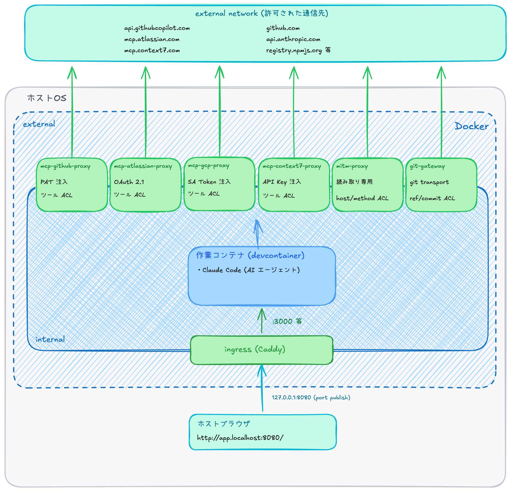

# 統合構成: 作業コンテナ単独起動向けの構成

本章は `integrated/single-workspace/` を扱う。ここまでの章 (06-09) で扱ったレシピを 1 つの compose に統合し、Claude Code が動く devcontainer 1 つで全ての隔離レイヤが同時に効く構成を組む。

## 1. 章のスコープ

これまでのレシピ各論 (cloud / web-fetch / git / ingress) は、それぞれ単独で動作可能な最小構成として書かれていた。本章ではそれらを **1 つの devcontainer に統合して同時に効かせる** 完成形を扱う。

統合構成の特徴:

- 作業コンテナ 1 つの中で Claude Code が普通に動き、`.mcp.json` で複数の MCP バックエンドが見える
- 外部への外向き通信は **すべてプロキシ経由のみ** (作業コンテナは Docker `internal: true` 1 つに閉じ込め)
- 内向きの開発サーバの公開 (`pnpm dev` のホスト到達) はリバースプロキシで別レイヤ
- 単独起動前提 (ホストポートが固定で複数スタックを同時起動できない)

本構成が向くユースケース:

- **並列稼働を想定しない** — 1 つの devcontainer の中で順次タスクを進める運用。1 つの作業コンテナの中でタスクを切り替えながら回す形に収まる場合
- **構成数を最小化したい** — shared-infra を別 compose プロジェクトとして常駐させず、1 つの compose で完結させたい場合

並列稼働 (= 複数の作業コンテナを同時に動かす環境) が必要になったら、ホストポートと OAuth トークンストアを全作業コンテナで共有する 2 層構造の次章 [11-multi-workspace.md](./11-multi-workspace.md) を選ぶ。両構成は同じホストポート (`127.0.0.1:8080` のリバースプロキシ、`127.0.0.1:3030` の OAuth コールバック) を使うため同時起動できず、ユースケースに応じて片方を選ぶ関係になる。

`integrated/single-workspace/` は GitHub / Atlassian / Context7 / GCP の 4 MCP + git-gateway + mitm + リバースプロキシで構成され、本リポジトリで扱う隔離レイヤをすべて含む。

## 2. 統合構造の全体像

6 つの外向き通信経路 (MCP × 4 + mitm + git-gateway) + 1 つのインバウンド (リバースプロキシ) という構造。作業コンテナは **internal ネットワーク 1 つ** にしか所属せず、外部に出る経路はプロキシ群経由しか存在しない。

## 3. 3 種類のプロキシの役割分担

統合構成では、2 種類の基本コンポーネント ([02-design.md](./02-design.md) §1.4) と用途特化のカスタムプロキシ ([02-design.md](./02-design.md) §3.2) の合計 3 種類が **直交する境界** を担う:

| プロキシ | 種別 | 境界の単位 | 主用途 |
|---|---|---|---|
| mcp-proxy (× 4) | 基本コンポーネント (細粒度・明示的) | MCP ツール名 | GitHub / Atlassian / Context7 / GCP の認証肩代わり + ツール ACL |
| mitm-proxy | 基本コンポーネント (粗粒度・暗黙的) | ホスト × HTTP メソッド × パス | 参照系のみ許可 (`registry.npmjs.org` GET 等) |
| git-gateway | 用途特化のカスタムプロキシ | ref / commit (HTTP body 解釈) | github.com 向け fetch + push (ref ACL) |

加えてリバースプロキシ (Caddy) がインバウンド経路として開発サーバをホストに見せる (上記 3 つはアウトバウンド方向、リバースプロキシはインバウンド方向で別レイヤ)。

「書き込みは mcp-proxy / git-gateway で扱い、mitm-proxy は読み取りのみ許可を主とする」という [02-design.md](./02-design.md) §3.1 + §3.2 の運用原則がそのまま適用形で実装されている。MCP には MCP ツール名で ACL を効かせ、git は ref / commit 粒度で効かせ、それ以外の HTTP の読み取りはホスト × パスで絞る、という役割分担が明確に分かれる。

## 4. 同一ホスト (github.com) に対する複数経路の網羅

`github.com` (および関連ホスト) は MCP (mcp-github-proxy) と git transport (git-gateway) の **両方が扱う** 典型例である。両者は同じ宛先ホストを異なる経路 (`api.githubcopilot.com` 経由の REST API と `github.com/<owner>/<repo>.git` への git transport) で扱うため、`github.com` に対して AI エージェントが何かしようとした時、**経路ごとに別の境界 / 別の粒度で ACL が効く** 構造になっている。

| 経路 | 担当境界 | 境界の単位 | 同経路上の追加防御 |
|---|---|---|---|
| MCP API (`api.githubcopilot.com` 経由) | mcp-github-proxy | MCP ツール名 (`--deny-tool 'delete_*' 'merge_*' 'push_*'` 等) | PAT スコープが GitHub 側で許す操作範囲に絞られている |
| git transport (`https://github.com/<owner>/<repo>.git`) | git-gateway | `ALLOWED_REPOS` (リポジトリ単位) / `ALLOWED_REF_PATTERNS` (ref / ブランチ単位) / コミット内容 | PAT スコープが GitHub 側で許す書き込み範囲に絞られている |
| `github.com` への HTTP 直叩き | mitm policy + 作業コンテナの gitconfig | `readonly_hosts` から `github.com` を外して原則拒否 + gitconfig の `insteadOf` で git-gateway に書き換え | (経路自体を成立させない構造) |

この構造により、「`github.com` というホストを許可した瞬間にすべての操作が許される」という粗い ACL に陥らず、操作の種類 (MCP ツール / git push / HTTP 直叩き) ごとに別の境界が別の粒度で制御できる。加えて、git transport では git-gateway の ACL の下流で PAT スコープが GitHub 側制限として効き、HTTP 直叩きは mitm policy で経路自体を成立させないことに加え gitconfig の書き換えで git-gateway 側に流すというように、同一経路上では多層的に塞ぐ形になっている。

## 5. 実行時の外向き通信と `pnpm install` の扱い

統合構成で工夫しているもう 1 つの点は、**`pnpm install` / `pnpm add` を実行時に直接走らせる** 構成にしていることである。

- `registry.npmjs.org` への GET (metadata + tarball) は mitm の読み取りのみ許可で通る
- `pnpm publish` のような POST / PUT はアドオンが 403 で拒否する **明確な境界** として効く
- 結果として作業コンテナ内から `pnpm add` を直接叩けるが、書き込み系は塞がれているため事故面が小さい

`alternatives/dependencies-build-time/` (付録 [alt-dependencies-build-time](./appendix/alt-dependencies-build-time.md)) は「実行時の外向き通信を経路ごと断つ」ためにビルド時インストールで焼き込むパターンで、強い隔離になる一方で依存追加がビルドを要する DX 上のコストが大きい。本統合構成では mitm の読み取りのみ許可を境界とすることで、**実行時にインストールを許しつつ publish 系はポリシーで塞ぐ** バランスに着地している。

実行時の外向き通信を経路ごと断ちたい脅威モデル向けには付録のビルド時インストールパターンが利用できる。

## 6. 評価軸との対応

[02-design.md](./02-design.md) §4 の 4 評価軸 + cloud (§6) で導入した「プロキシ内の認証情報の短寿命化」軸を、統合構成がどう満たすか:

| 評価軸 | このレシピがどう満たすか |
|---|---|
| 秘匿情報は作業コンテナ外に置く | API トークン / OAuth リフレッシュトークン / CA 秘密鍵はすべてホスト側 (`env_file` / バインドマウント / 名前付きボリュームのいずれか) に閉じ、プロキシ群だけが読み込む。作業コンテナ側のファイルシステムにも環境変数にも入らない |
| 作業コンテナはプロキシのみと通信する | 作業コンテナは internal ネットワーク 1 つに閉じ、5 つのプロキシ経由でしか外に出られない |
| ACL はプロキシ側で評価する | 操作粒度 (MCP ツール名) / HTTP 層 (ホスト × HTTP メソッド × パス) / Git transport (ref / commit) の 3 つすべてプロキシ側で評価 |
| 境界ドメインは信頼できる先に限定する | mitm-proxy のポリシーで trusted / readonly_hosts に明示列挙、git-gateway も `UPSTREAM_BASE_URL=https://github.com/` 固定 |
| (cloud で追加) プロキシ内に長寿命の認証情報を置かない | `mcp-gcloud-proxy` はホスト側で発行された 1h 寿命の SA アクセストークンを ro mount で読むだけ。リフレッシュトークン / 個人 ADC はプロキシにも作業コンテナにも届かない |

これにより本統合構成は本リポジトリで提示している全評価軸を満たす。

## 7. 詳細はレシピ README へ

利用手順 (API トークン / OAuth トークン / ACL の環境変数配置、初回 OAuth 認可、リバースプロキシの `Host` マッピング追加、`.claude/settings.json` の構成、`pnpm install` の挙動) はレシピ README に集約してある:

- [`integrated/single-workspace/README.md`](../integrated/single-workspace/) — 統合構成の構築手順 + 各プロキシの環境変数構造 + 隔離されているもの一覧 + 残る漏れ余地

## 8. 次の章への接続

本統合構成は単独起動前提で、ホストポートが固定。作業環境として「同一プロジェクトを複数の作業コンテナで並列展開し、それぞれで別タスクを進める」用途が必要になった時点で不都合が生じる。次章は同じ統合構成を **並列起動前提** に書き直したもう 1 つの選択肢を扱う。

- [11-multi-workspace.md](./11-multi-workspace.md) — 作業コンテナ並列起動向けの構成
