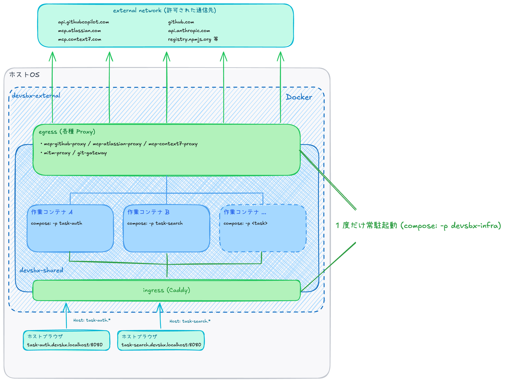

# 統合構成: 作業コンテナ並列起動向けの構成

本章は `integrated/multi-workspace/` を扱う。前章 ([10-single-workspace.md](./10-single-workspace.md)) の単独起動の完成形を **並列起動前提に書き直した** もので、ホストポートと shared-infra を全作業コンテナで共有する 2 層構造を採る。

## 1. 章のスコープ

[10-single-workspace.md](./10-single-workspace.md) は「1 ホストで 1 スタック」前提の統合構成だった。本章はそれを **「同一プロジェクトを複数の作業コンテナで並列展開し、それぞれで別タスクを進める作業環境」前提** に書き直した形を扱う。

両者はユースケースに応じて選ぶ対等な統合構成として並存しており、選択軸は次の通り:

- **`integrated/single-workspace/` (前章)** — 並列稼働を想定しないとき。shared-infra を別 compose プロジェクトとして常駐させず、構成数を抑えたい場合に向く
- **`integrated/multi-workspace/` (本章)** — 同一プロジェクトの作業コンテナを **同時に** 複数走らせて並列タスクを進めたいとき。全作業コンテナで共有するリバースプロキシ (`127.0.0.1:8080`) にサブドメインで振り分け、OAuth リフレッシュの競合を回避するために shared-infra にプロキシ群を 1 度だけ立てる構造に倒す

両者は同じホストポート (`127.0.0.1:8080` のリバースプロキシ、`127.0.0.1:3030` の OAuth コールバック) と OAuth トークンストアを共有するため **同時起動は不可** (排他運用)。

## 2. なぜ並列起動が要るか

`integrated/single-workspace/` (単独起動) を複数の作業コンテナで並列展開すると、構造的な限界が露見する:

- **ホストポート衝突** — リバースプロキシの `127.0.0.1:8080` (開発サーバのインバウンド) と `127.0.0.1:3030` (OAuth コールバック) が並列度ぶん必要になる
- **OAuth リフレッシュの競合** — 各作業コンテナが独立に `mcp-atlassian-proxy` を起動して同じトークンストアを共有すると、リフレッシュトークンの one-time use 制約 (プロバイダ側でローテートされる多数) に抵触する
- **プロキシのリソース重複** — mcp-* / mitm-proxy / git-gateway が作業コンテナ数に比例して起動する

これらは個別の対症療法 (プロジェクトごとに HOST_PORT を変える / トークンストアにファイルロックを入れる / etc.) で凌げるが、根本解は **サンドボックス全体を 2 層に分割する** こと。具体的には、共有のインフラ (プロキシ群 + リバースプロキシ) を 1 度だけ常駐起動し、タスクごとの作業コンテナを別 compose プロジェクトとして並列に起動する形に再構成する。

## 3. 2 層構造のアーキテクチャ

2 層は次のように起動する:

- **shared-infra**: `docker compose -p devsbx-infra up -d` で **1 度だけ常駐起動**。全作業コンテナで共有されるプロキシ群と共有のリバースプロキシが立ち上がる
- **per-task workspace**: `docker compose -p <task> up -d` で **タスクごとに別 compose プロジェクトとして起動**。`<task>` の値がそのままサブドメインの接頭辞 (`<task>.devsbx.localhost:8080`) になる

作業コンテナ側は **2 つのネットワークに参加** する: 自分専用の `<task>_internal` (internal: true、外向き通信を Docker ネットワーク設定で遮断) と、shared-infra と共有する `devsbx-shared` (shared-infra が `name: devsbx-shared` で明示作成、per-task が `external: true` で参照)。前者で外部への外向き通信を塞ぎつつ、後者で shared-infra 経由でしか外に出られない構造になる。

## 4. ルーティング管理を Docker DNS に移譲する

並列起動された複数の作業コンテナを 1 つのリバースプロキシ (ホストポート 8080) で振り分けるには、**作業コンテナの起動 / 停止に追従するルーティング** が要る。素直に解こうとすると Caddy admin API を露出する / 共有の名前付きボリュームにスニペットを書き込んでファイル監視でリロードする、といった構造になるが、いずれも **作業コンテナや同ネットワーク内の他コンテナから書き換え可能な制御層** を新設することになり、作業コンテナ自身に認可を制御させないという本リポジトリの方針を破る方向に向かう。

本レシピの核心は、**ルーティング管理を Docker DNS (= [03-foundation.md](./03-foundation.md) で信頼基盤として前提にした層) に完全に移譲する** ことである。作業コンテナのサブドメインを Docker DNS 上のサービス名に対応付ける形のリバースプロキシ設定を 1 度だけ書いておけば、作業コンテナの追加 / 削除は Docker デーモンが DNS に反映し、Caddy は DNS 解決の結果をその都度使うだけ。Caddy 側に「ルーティングを変更するための入り口」を一切持たせない構造に倒せる。

結果として、信頼境界の外に置きたかった制御層がすべて消える:

- **Caddy admin API を露出する必要がない** — 作業コンテナから admin ルートを書き換える経路を作らない
- **共有の名前付きボリュームにスニペットを書き込む経路がない** — 作業コンテナ間でスニペットを改変するリスクを作らない

つまり [03-foundation.md](./03-foundation.md) の安全性モデル条件 1 で前提にした **Docker デーモン / Docker DNS の信頼性を、ルーティング管理のための制御層として活用する** ことで、それより上のレイヤ (Caddy 設定) を完全に静的に保てる、というのが本設計の肝である。新しい信頼境界 (admin API / 共有ボリューム) を増やさずに動的ルーティングを実現する。

実装上の Caddyfile / Docker DNS の挙動 (サブドメインの正規表現マッチの書き方、起動 / 停止時の DNS 反映、Caddy の DNS キャッシュ周りの挙動) は [`integrated/multi-workspace/README.md`](../integrated/multi-workspace/) および単体検証用に切り出した [`recipes/ingress-multi-workspace/`](../recipes/ingress-multi-workspace/) を参照。

## 5. 共有構成のトレードオフ (許容する漏れ)

2 層構造は単独起動より構造が複雑になり、その代償として **本リポジトリで明示的に許容する漏れ** がいくつか生まれる。すべて個人開発前提の脅威モデル外として位置付けてある:

- **作業コンテナ間の到達可能性** — `devsbx-shared` 1 ネットワークに全作業コンテナが参加するため、作業コンテナ A が作業コンテナ B の `:3000` に到達可能。「個人開発者が並列で作業コンテナを回す」前提で許容
- **Docker デーモンを共有する他 compose プロジェクトからの到達** — `devsbx-shared` / `devsbx-external` は別 compose プロジェクトから参照させるため `name:` 固定で公開している。その代償として、同 Docker デーモンを使う任意の他 compose プロジェクトが `external: true, name: devsbx-shared` で参加可能 = mcp-proxy 等を Bearer 無しで叩ける位置に立てる。**Docker デーモンを共有する他プロジェクトは信頼前提** で運用する (= Docker デーモン上に起動するもの全てが利用者本人の責務)
- **shared-infra 全体の侵害時の影響範囲** — 共有サービスが侵害されると全作業コンテナに影響波及。単独構成 (`integrated/single-workspace/`) より影響範囲が大きい

これらは共用の開発マシン / CI ランナーで本レシピを使う場合に問題になり得る。その場合は共有の秘匿情報による認証や別の Docker デーモン (rootless docker / Podman 等) への分離を別途検討する必要がある。個人開発ローカルでは脅威モデル外として割り切る。

## 6. 評価軸との対応

[02-design.md](./02-design.md) §4 の 4 評価軸 + cloud (§6) で導入した「プロキシ内の認証情報の短寿命化」軸を、本統合構成がどう満たすか:

| 評価軸 | 本レシピがどう満たすか |
|---|---|
| 秘匿情報は作業コンテナ外に置く | API トークン / OAuth リフレッシュトークン / CA 秘密鍵はすべてホスト側 (`env_file` / バインドマウント) または shared-infra 内の名前付きボリュームに閉じ、プロキシ群だけが読み込む。作業コンテナ側のファイルシステムにも環境変数にも入らない |
| 作業コンテナはプロキシのみと通信する | 作業コンテナは `<task>_internal` (internal: true) + `devsbx-shared` (internal: true) の 2 ネットワークに閉じ、プロキシ群経由でしか外に出られない |
| ACL はプロキシ側で評価する | 操作粒度 (MCP ツール名) / HTTP 層 (ホスト × HTTP メソッド × パス) / Git transport (ref / リポジトリ) の 3 軸すべて shared-infra 側で評価 |
| 境界ドメインは信頼できる先に限定する | mitm-proxy のポリシー + git-gateway の `UPSTREAM_BASE_URL` で明示列挙されたドメインだけが通る |
| (cloud で追加) プロキシ内に長寿命の認証情報を置かない | shared-infra の `mcp-gcloud-proxy` はホスト側で発行された 1h 寿命の SA アクセストークンを ro mount で読むだけ。リフレッシュトークン / 個人 ADC は shared-infra にも作業コンテナにも届かない |

並列構成でも単独構成と同じ評価軸を満たすことが、2 層構造への分割で崩れないように設計されている。

## 7. 詳細はレシピ README へ

実装の詳細 (各 mcp-* プロキシの環境変数構造、GitHub PAT スコープの最小化、初回 OAuth 認可、検討して採用しなかった代替案) はレシピ側 README に集約してある:

- [`integrated/multi-workspace/README.md`](../integrated/multi-workspace/) — 並列起動の構築手順 + 設計判断の根拠 + 利用フロー + 漏れる余地

## 8. 統合構成までの到達点

ここまでで本リポジトリが提示する 2 つの統合構成 (`integrated/single-workspace/` と `integrated/multi-workspace/`) が出揃った。本書の安全性モデル ([02-design.md](./02-design.md) §2) で示した「3 層に脆弱性がない限り情報漏洩を起こさない」設計が、5 つの評価軸を満たす形で単独 / 並列の両構成に展開されたことを、本章までの 11 章で見てきた。

本書本編はここで一区切り。

ここから先は付録として、本編から外して保持している代替案・検討項目を扱う:

- [alt-dependencies-build-time.md](./appendix/alt-dependencies-build-time.md) — 実行時疎通先の最小化
- [alt-simple-http-proxy.md](./appendix/alt-simple-http-proxy.md) — 独自 CA 不要の mitm-proxy 代替
- [alt-git-mitm-proxy-addon.md](./appendix/alt-git-mitm-proxy-addon.md) — git-gateway の軽量代替
- [incomplete-fetch-mcp.md](./appendix/incomplete-fetch-mcp.md) — 任意ホスト fetch の構造的限界

巻末:

- [99-postscript.md](./99-postscript.md) — あとがき
